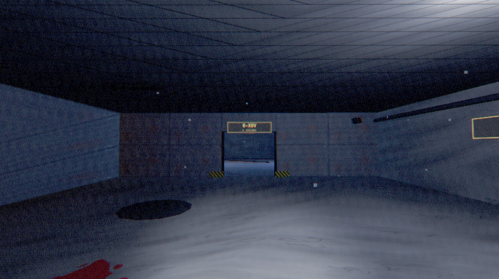
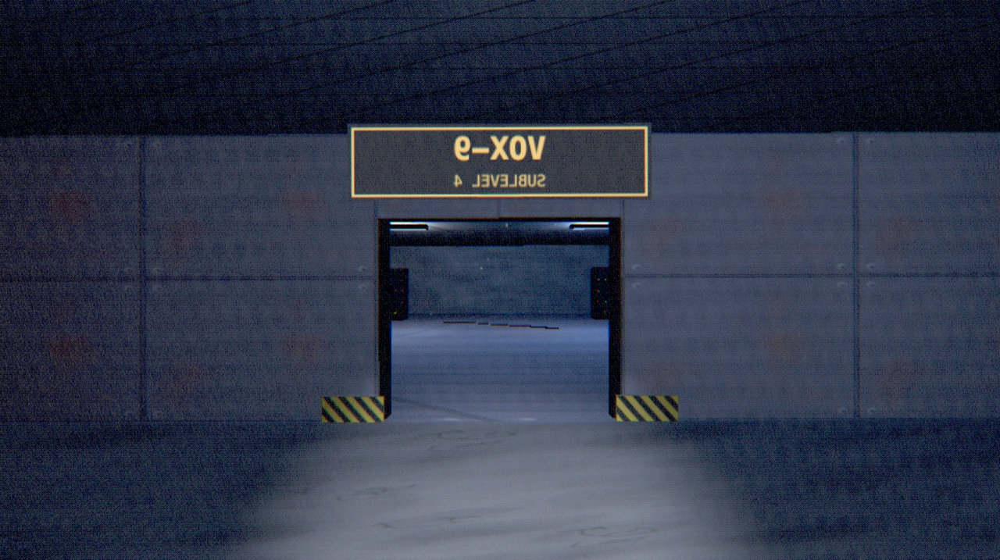
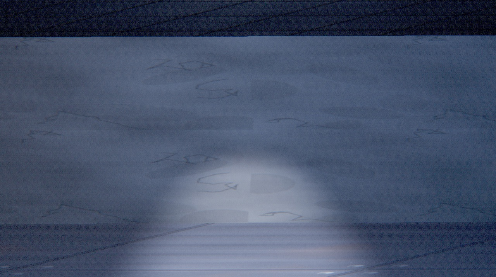
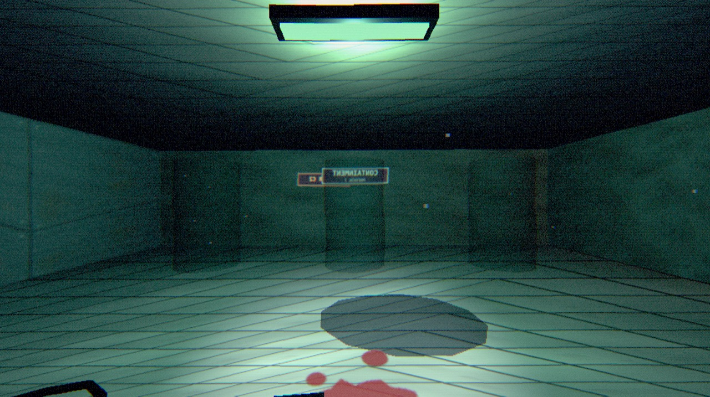
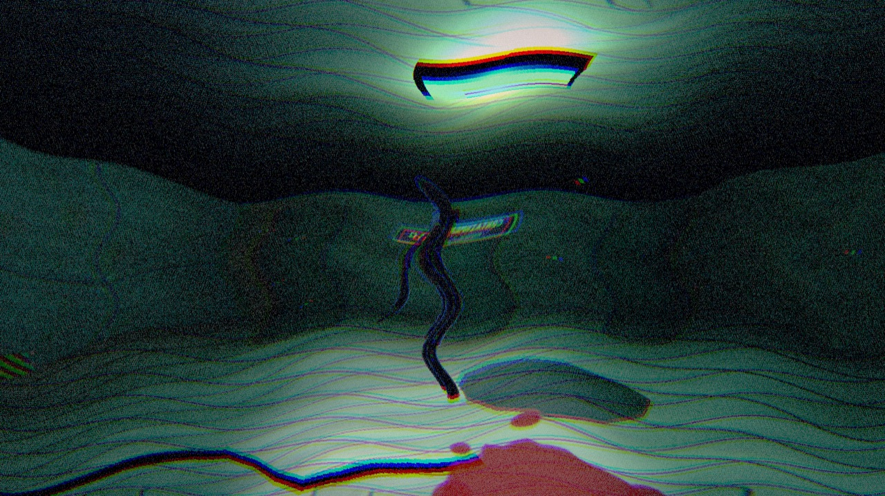

# THE HUM

*It hears you.*



**THE HUM** is a browser-based first-person survival horror game with one unusual
rule: the thing hunting you can hear your real room. Your keyboard, your chair, your
breathing — the microphone in your machine is part of the game.

**Play now:** https://pseud0coder.github.io/The_Hum/

No install, no download. Chrome / Brave / Edge. Headphones strongly recommended.

## The Hum

The crew of the Vox-9 research station studied sound that behaved like matter. It
learned. It echoed back things they had never said. They gave it a name before they
stopped talking: **the Hum**.

It does not patrol a scripted path. It listens.

- **Your footsteps are a language.** Walk quietly. Crouch. But sprinting is a scream
  in the dark, and thrown bottles are only decoys.
- **Your microphone is a second door into the room.** If you talk, laugh, or bang
  your desk, it hears that too — and it comes. You can run "deaf" (footsteps only)
  if you would rather not share your room.
- **It remembers you.** Hide in the same locker across runs and it will check that
  locker first. Its map of your favourite hiding places is saved between sessions.
- **Your past runs walk again.** Die, and your previous route is replayed by your own
  ghost. Reach the end of that route and it turns solid — and it is no longer a ghost.
- **Carrying the cores makes you loud.** Every resonance core you recover pulls the
  Hum closer to you. The more you carry, the less time you have.

## Survive

Recover **four resonance cores**, bring them to the extraction elevator, and release
containment. Then stand still, stay quiet, and let it listen.

| Key | Action |
| --- | --- |
| `WASD` | move |
| `Mouse` | look |
| `Shift` | sprint (loud, drains stamina) |
| `Ctrl` / `C` | crouch (quiet) |
| `F` | flashlight (it can see your light) |
| `E` | hide in lockers / use the elevator |
| `Q` | throw a bottle (noise decoy) |
| `Space` | hold your breath |
| `Esc` | pause |

Scattered through the facility: battery cells for your light, bottles to throw, and
stimpacks that grant twenty seconds of sprint boost. When the finale begins, the game
asks for **eight seconds of real silence** — the meter on screen is your actual
microphone. Good luck.

## Screenshots


*Every room is procedurally furnished and lit by failing lamps — and by the flashlight that gives you away.*


*Server halls hum. The calibration screen tells you: that is not the machines.*


*Containment. The green tanks are the only light down here.*


*It has no face, only a mouth. It reads your light, your sound, and your habits.*

## Under the hood

- **Zero asset files.** Every texture, sign, and stain is drawn procedurally on
  canvas; every sound — the drone, the heartbeat, the whispers, the screech — is
  synthesized live with the Web Audio API. Three.js is vendored, so the whole game is
  a handful of files with no build step.
- **PS1-era presentation.** Low-resolution render target, vertex snapping, affine
  texture warping, Bayer dithering, film grain, chromatic aberration.
- **A microphone that never leaves your machine.** Audio is analysed locally and is
  never recorded, stored, or uploaded. There is no backend — the game is fully static.
- **It learns across sessions.** Deaths, routes, and hiding places persist in your
  browser. Nothing is shared between players.

## Run it locally

```bash
python3 serve.py 8130
# open http://localhost:8130
```

`serve.py` is a small dev server with no-cache headers and a debug capture endpoint.
Any static file server works — the game is just `index.html`, `src/`, and `vendor/`.

Append `?auto=run|view|flash|hunt|hold|death|escape|ghost` to jump straight into a
scenario with an on-screen state overlay.
